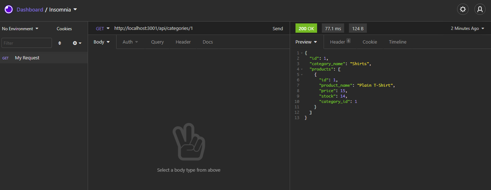
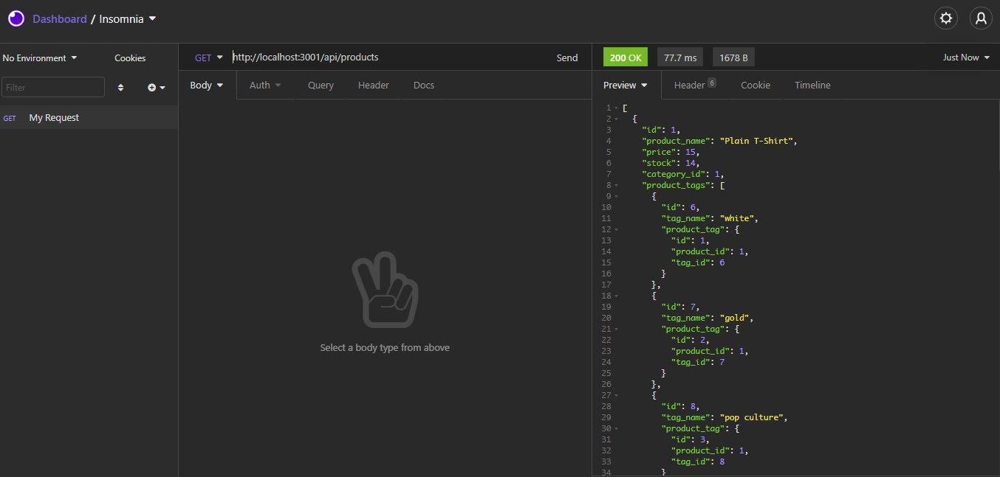
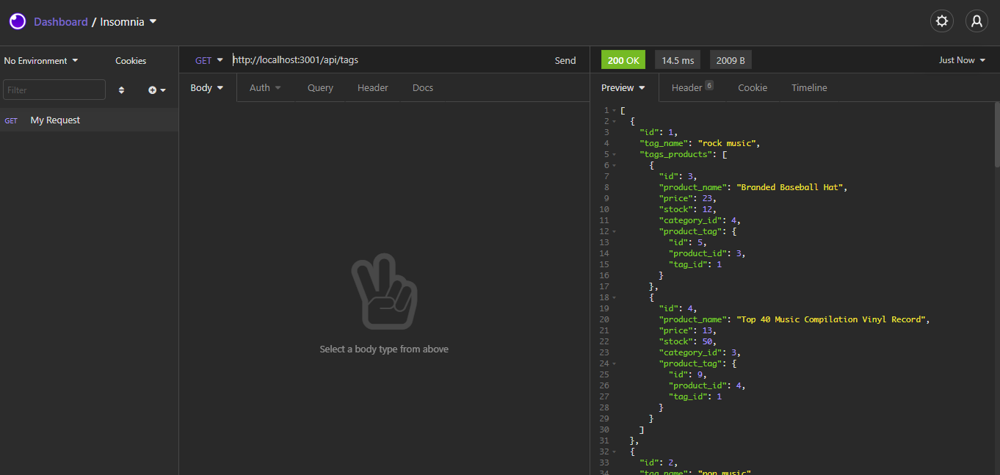

# P11-E-Commerce-Back-End

## App Description
This backend is built so that owners of E-Commerce websites are able to upload their products to their websites and users of their sites will be able to look for products by categories, tags, and specific items.

## Screenshot

## Using the E-Commerce Backend
### Get requests
In order to get the categories, tags or items, you would need to use the get request.

### Post requests
So that you can add categories, tags or items, you would need to use post requests.

### Put requests
In case you need to replace information from existing categories, tags or items, you need to use the put request.

### Delete requests
If you want to delete categories, tags or items, you need to use the delete request.